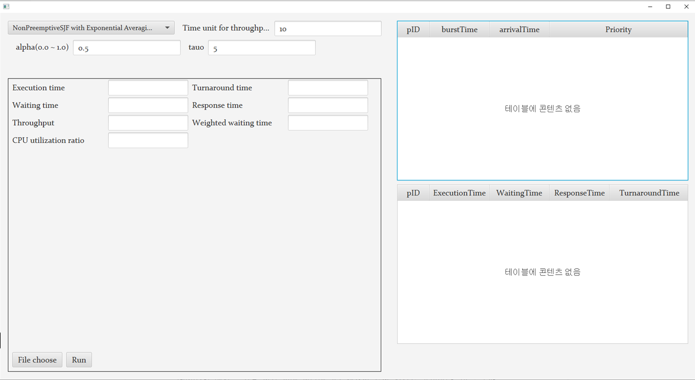
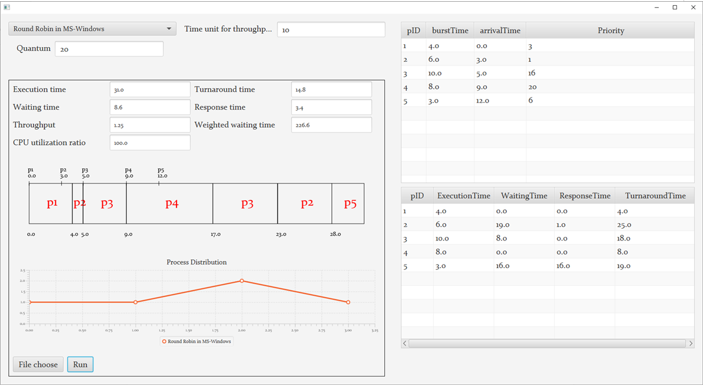
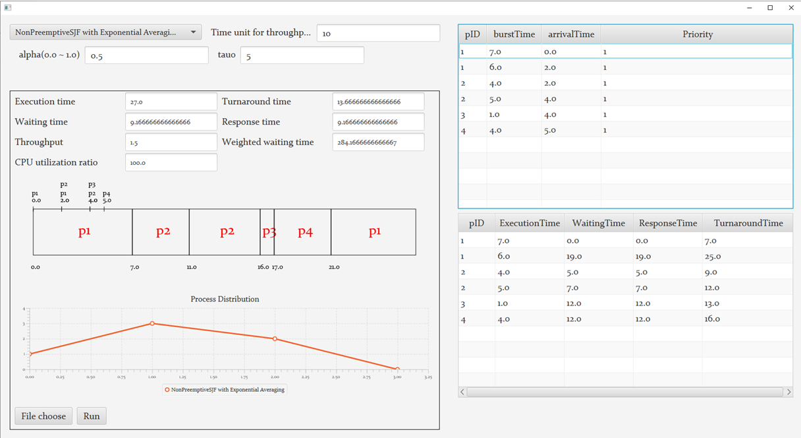
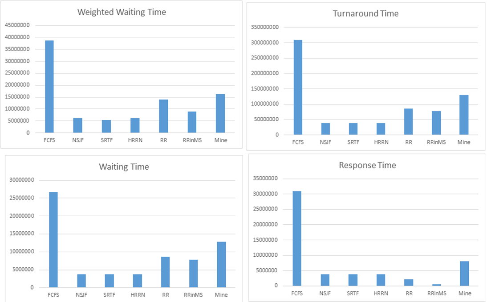
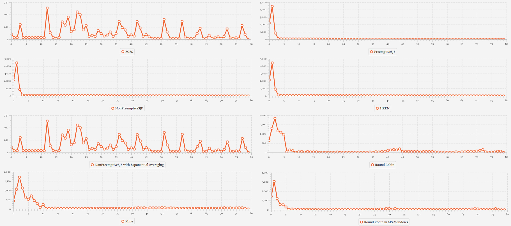

# CPU-Scheduler-Visualization
CPU Scheduler Visualization written in Kotlin TornadoFX

## 목적
CPU Secheduling algorithm을 시각화해주는 프로그램입니다.
FCFS, NonPreemptiveSJF, NonPreemptiveSJF with exponential averaging, PreemptiveSJF, HRRN, Round Robin, RoundRobin in MS-Windows 등을 지원합니다.
최종 업데이트 날짜 : 2021/11/22

## 결과
초기화면

실행화면1

실행화면2

간단한 실험 결과

프로세스 1만개를 입력으로 줬을 때 프로세스 종료 시간 분포
* x축은 시간, y축은 종료된 프로세스 수
* 데이터는 [The CEA Curie log](https://www.cs.huji.ac.il/labs/parallel/workload/l_cea_curie/)를 가공해서 사용함.
* 프로세스 우선순위는 0&#126;31의 값을 임의로 생성함. 4&#126;26까지의 값이 80% 확률로 생성되게 함.

이 외에도 본 프로그램을 사용해 입력 파라미터에 따른 결과 변화 등 다양한 실험을 진행할 수 있다.

TODO: context overhead 추가
